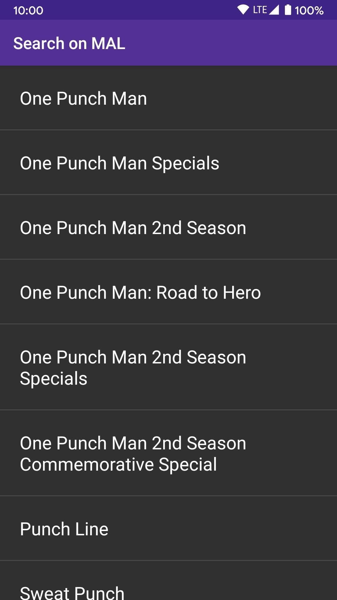
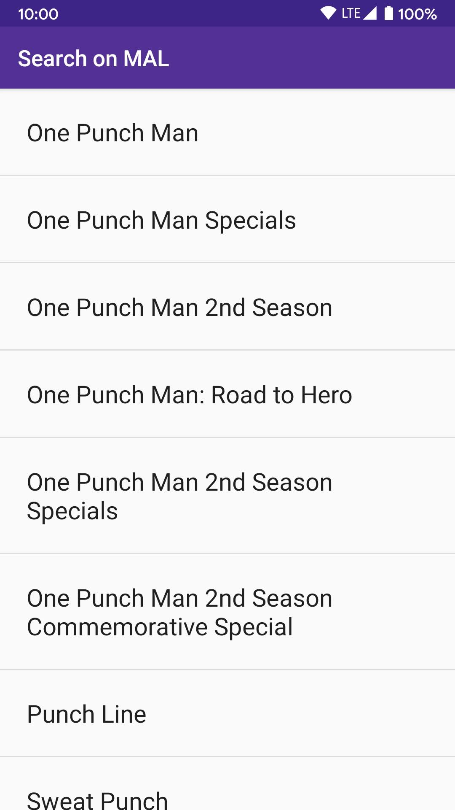

# **Note:** Due to changes in the Jikan API, as of September 1, 2022, search results may break or not work as expected. I am currently looking into alternatives to Jikan.

# MyAnimeList SeriesGuide Extension

[View on the Google Play Store](https://play.google.com/store/apps/details?id=com.malseriesguideextension)

This is a simple [SeriesGuide](https://seriesgui.de/) extension that will allow you to go to the
corresponding page on MyAnimeList for a show directly from SeriesGuide. It uses the unofficial
[Jikan API](https://jikan.moe/) to fetch information.

This app is not affiliated with SeriesGuide or MyAnimeList in any way.

## Screenshots

